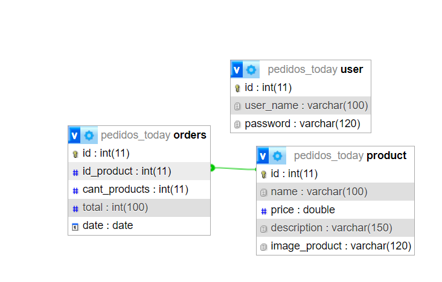

# **Participantes:**
-Maria Jose Giannaccini
-Juan Pablo Chiclana Urraco
  

# Descripcion:
Elegimos realizar una pagina de pedidos en un local de comidas rapidas. Va a constar inicialmente de dos tablas: una llamada product, la cual contiene un id de tipo primary, auto incremental; un name, de tipo varchar; un price y una description del producto.
Y una segunda tabla llamada orders, que se relaciona con la tabla producto a traves de su clave foranea id_product. Tambien cuenta con su id de tipo primary auto incremental; una cant_products; un total, que va a definir el total a pagar y una date, de tipo date. 

# Pautas para el despliegue de la web:
- Tener instalado xampp y encendido Apache y MySQL.
- Clonar el repositorio en la carpeta xampp/htdocs.
- Crear la base de datos con el nombre pedidos_today (las tablas se crean automaticamente por la implementacion del auto Deploy), o se puede importar la base de datos completa desde phpMyAdmin, el archivo llamado db/pedidos_today.sql 
- Luego en el browser, ingresar al localhost y dirigirse a la carpeta donde se guardo el repositorio, y de esta forma la pagina se carga y se visualiza.
- Para poder realizar las modificaciones en las tablas se debe iniciar sesion, para ello el usuario registrado es:
usuario: webadmin
contraseña: admin
